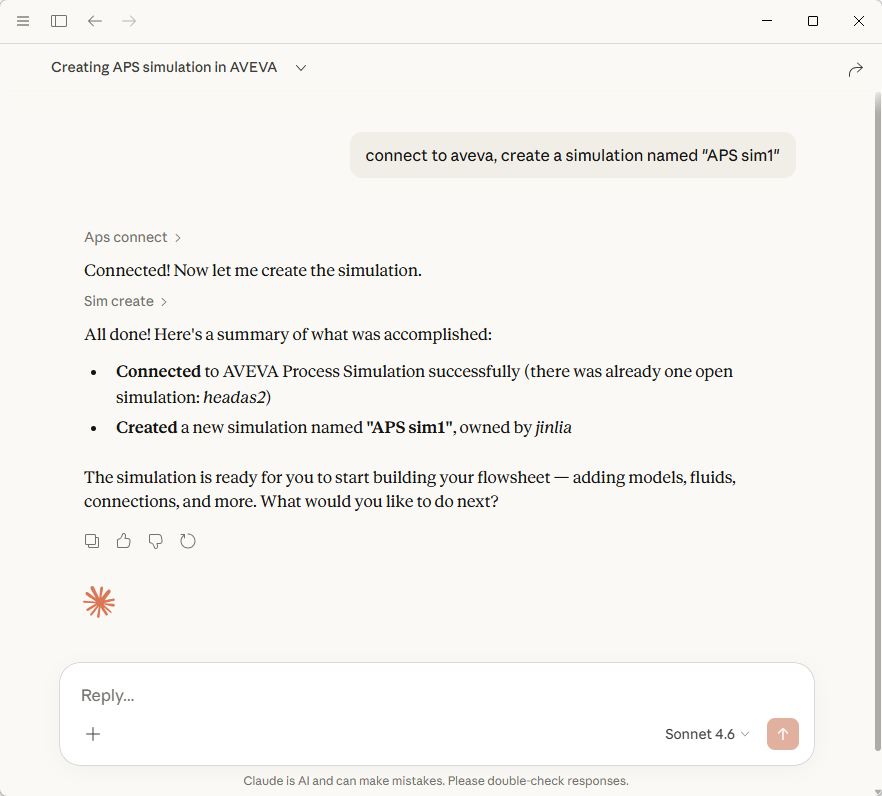

# AVEVA MCP Server (Compiled Distribution)

A **Model Context Protocol (MCP)** server that exposes AVEVA process simulation tools to AI applications like Claude Desktop, Cursor, and other MCP-compatible clients.


## ⚠️ Requirements

| Requirement | Version |
|-------------|---------|
| **Python** | **3.13.x** (must match exactly) |
| **OS** | Windows 10/11 (64-bit) |
| **AVEVA SDK** | Installed separately |

> **Important:** The compiled `.pyd` files are built for Python 3.13. Using a different Python version will cause import errors.

## 🚀 Quick Start

### 1. Install Dependencies

```bash
pip install -r requirements.txt
```

> **Note:** AVEVA dependencies must be installed separately from the AVEVA SDK.

### 2. Run the MCP Server

```bash
# Default: stdio transport (for Claude Desktop/Cursor)
python start_aveva_mcp_server.py

# SSE transport (for web-based clients)
python start_aveva_mcp_server.py sse --port 8000

# Streamable HTTP transport (for modern clients)
python start_aveva_mcp_server.py http --port 8000
```
If you run successfully, you can stop the server and move on to next step.

### 3. Configure Claude Desktop (MCP client)
You can find a detailed tutorial on how to locate and edit your Claude Desktop configuration file in the official documentation: [Connect to local MCP servers](https://modelcontextprotocol.io/docs/develop/connect-local-servers)
For other MCP clients, please refer to their respective documentation on configuring local MCP servers. Although the interfaces may differ, the core logic remains the same:
you need to specify:

- Specify the **Python executable** that will run the server  
- Specify the **path to the script** that launches your MCP server  

Add the following to your Claude Desktop configuration file. Update the paths to match your environment:

```json
{
  "mcpServers": {
    "aveva": {
      "command": "C:/Users/xxxx/AppData/Local/miniconda3/envs/your_py313_env/python.exe",
      "args": [
        "C:/path/to/distribute/start_aveva_mcp_server.py"
      ]
    }
  }
}
```


You can see the claude agent use the tool "Aps connect" and "Sim create" for the task.

### 4. Verify Installation

```bash
python -c "from aveva_mcp_server import mcp; print('Server ready!')"
```

## 📁 Package Contents

| File | Description |
|------|-------------|
| `start_aveva_mcp_server.py` | Main launcher script |
| `aveva_mcp_server.py` | MCP server with tool definitions |
| `requirements.txt` | Python dependencies |
| `tools/*.pyd` | Compiled logic modules |
| `tools/__init__.py` | Package initializer |

## 🔧 Troubleshooting

### "DLL load failed" or "ImportError"
- Ensure you are using **Python 3.13.x** (64-bit)
- Run `python --version` to verify

### "ModuleNotFoundError: No module named 'fastmcp'"
- Run `pip install -r requirements.txt`

### AVEVA connection errors
- Verify AVEVA Process Simulation is installed
- Ensure AVEVA SDK Python components are accessible
- Test with: `python -c "import simcentralconnect; print('AVEVA OK')"`

## 📚 Learn More

- [Model Context Protocol](https://modelcontextprotocol.io/docs/getting-started/intro)
- [FastMCP Documentation](https://github.com/jlowin/fastmcp)
- [MCP Python SDK](https://github.com/modelcontextprotocol/python-sdk)
- [AVEVA Process Simulation Documentation](https://aveva.com)

---

## Citation
[Liang, Jingkang, Niklas Groll, and Gürkan Sin. "Large Language Model Agent for User-friendly Chemical Process Simulations." *arXiv preprint arXiv:2601.11650* (2026).](https://arxiv.org/abs/2601.11650)
